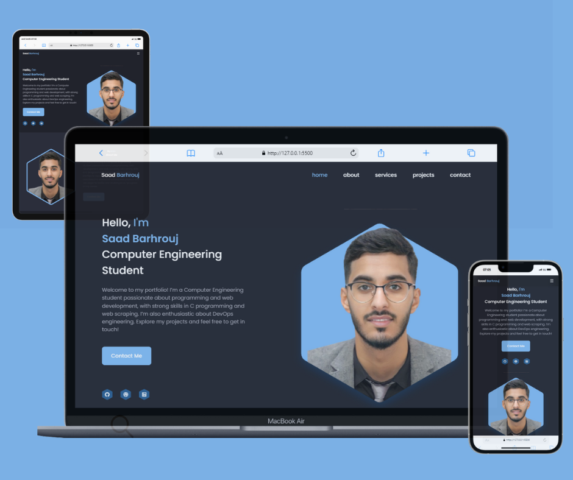

# Responsive Personal Portfolio Website 🌐

Welcome to my **Responsive Personal Portfolio Website**! 🎨

## Description

This project showcases a personal portfolio website designed to present my skills, projects, and contact information. It features a modern and responsive design, ensuring it looks great on any device. The website includes sections for home, about, services, projects, and contact, each highlighting different aspects of my work and experience. 🚀



## Features

- **Responsive Design:** 📱 Optimized for all devices and screen sizes.
- **Home Section:** 🏠 Introduction with a brief about me and social links.
- **About Section:** 📖 Detailed information about my background and interests.
- **Skills Section:** 💪 Overview of my skills and expertise.
- **Services Section:** 🛠️ Description of the services I offer.
- **Projects Section:** 📂 Showcase of recent projects with demo links.
- **Contact Section:** 📩 Form to get in touch with me directly.

## Technologies Used

- **HTML** 🌍
- **CSS** 🎨
- **JavaScript** ⚙️
- **Remixicon** 🖼️
- **SVG Graphics** 📊
- **EmailJS** 📧 for contact form

## Live Demo

Check out the live version of the website [here](https://portfolio-saad-barhrouj.netlify.app/). 🌟

## Installation

To run this project locally:

1. Clone the repository:
    ```bash
    git clone https://github.com/SaadBarhrouj/Responsive-Personal-Portfolio-Website.git
    ```
2. Navigate to the project directory:
    ```bash
    cd Responsive-Personal-Portfolio-Website
    ```
3. Open `index.html` in your browser to view the website. 🌐

## Contribution

Feel free to fork the repository and contribute to the project. For any issues or suggestions, please open an issue or submit a pull request. 💡

## Contact

For any inquiries or feedback, you can reach me via:

- **Email:** [Saad Barhrouj](saad.barhrouj@etu.uae.ac.ma) 📧
- **LinkedIn:** [Saad Barhrouj](https://www.linkedin.com/in/saad-barhrouj-b37270295/) 💼
- **GitHub:** [SaadBarhrouj](https://github.com/SaadBarhrouj) 🐙

Thank you for visiting my portfolio! 😊
